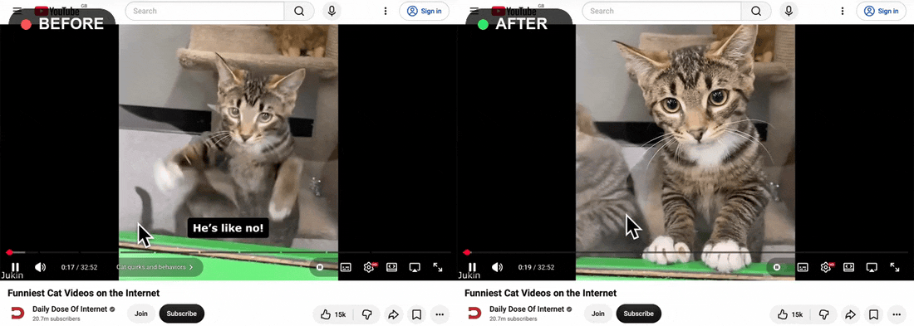

# Youtube Remove AI Chapters

Removes YouTube's AI-generated video chapters. Chapters added by the creator are not changed.

## Why

YouTube now add AI-generated chapters to videos that did not have any. These chapters are not only not very informative, sometimes misleading, but also make scrubbing the video more difficult.

This script removes these chapters, so only videos where the chapters are created by the original video creator are kept.

## Install

You can install the script directly from [greasyfork](https://greasyfork.org/en/scripts/598706-youtube-remove-ai-chapters)

You can also install the script manually:

1. Install a userscript manager for your browser (table below)
2. Open the [raw script](https://raw.githubusercontent.com/moocj/yt-remove-ai-chapters/main/yt-remove-ai-chapters.user.js). Your manager should offer to install the script for you.
3. Reload Youtube.

| Browser | Manager |
|---|---|
| Safari (macOS/iOS) | [Userscripts](https://apps.apple.com/app/userscripts/id1463298887) |
| Chrome/Firefox/Edge | [Tampermonkey](https://www.tampermonkey.net/), [Violentmonkey](https://violentmonkey.github.io/) or [Greasemonkey](https://www.greasespot.net)|

### Chrome notes

The latest chrome versions may block userscripts unless you allow them. To do this:

1. Open `chrome://extensions`
2. Find your userscript manager's **Details** page.
3. Turn on **Allow User Scripts**.

## Issues

If the script stops working, [open an issue](https://github.com/moocj/yt-remove-ai-chapters/issues), following the template as best you can.

## License

[MIT](LICENSE)
